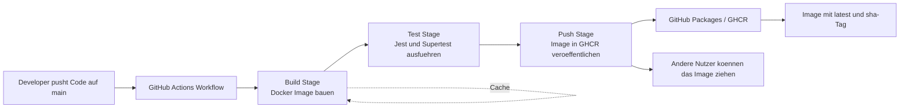

# C2 - CI/CD mit GitHub Actions

Saime Fazlija
Modul: Distributed Execution Platform | Aufgabe: C2 - CI/CD mit GitHub Actions

## 1. Was wurde umgesetzt und warum?

Dieses Repository enthaelt eine kleine Express-Anwendung mit Docker und einer CI/CD-Pipeline auf GitHub Actions. Bei jedem Push auf `main` wird die Pipeline automatisch ausgefuehrt. Sie baut das Docker-Image, fuehrt automatisierte Tests aus und veroeffentlicht das Image in der GitHub Container Registry (GHCR).

Ziel ist, Build, Test und Verteilung zu automatisieren. Dadurch werden Fehler frueher sichtbar und das Image muss nicht mehr manuell gebaut oder gepusht werden. Ausserdem wird jede Version nachvollziehbar gespeichert.

Warum GitHub Actions:
- direkt in GitHub integriert
- einfache YAML-Konfiguration im Repository
- klare Stages mit `needs`
- automatische Abbrueche bei Fehlern

Warum Docker und GHCR:
- Docker sorgt fuer dieselbe Laufzeit lokal und in CI
- GHCR ist direkt mit GitHub verbunden
- die Anmeldung laeuft ueber `GITHUB_TOKEN`, ohne Passwort im Code

## 2. Pipeline-Uebersicht

| Stage | Zweck | Ergebnis |
| --- | --- | --- |
| Build | Docker-Image bauen und Cache erzeugen | Image ist technisch pruefbar |
| Test | Abhaengigkeiten installieren und Tests ausfuehren | Nur bei Erfolg geht es weiter |
| Push | Image in GHCR veroeffentlichen | Image ist in den GitHub Packages verfuegbar |

Fehlerbehandlung:
- Build-Fehler stoppen die Pipeline vor Test und Push
- Test-Fehler stoppen die Pipeline vor dem Push
- Push laeuft nur nach erfolgreichem Build und Test

### Architektur / Ablauf



Die Grafik zeigt den Weg vom Push bis zum veroeffentlichten Image. Die drei Stages laufen nacheinander, und nur bei Erfolg wird das Image in die Packages geschrieben.

## 3. Verwendete Komponenten

| Bereich | Verwendet | Zweck |
| --- | --- | --- |
| CI/CD | GitHub Actions | Fuehrt die Pipeline automatisch aus |
| Trigger | Push auf `main`, manuell via `workflow_dispatch` | Startet die Pipeline |
| Container | Docker | Erstellt das Image |
| Build | Docker Buildx | Baut Images mit Cache-Unterstuetzung |
| Caching | GitHub Actions Cache | Beschleunigt spaetere Builds |
| Registry | GitHub Container Registry (GHCR) | Speichert das Docker-Image |
| Authentifizierung | `GITHUB_TOKEN` | Anmeldung bei GHCR |
| Runtime | Node.js 22 | Fuehrt die Anwendung aus |
| Paketmanager | npm | Installiert Abhaengigkeiten |
| Tests | Jest / Supertest | Fuehrt automatisierte Tests aus |
| Optionaler Code-Check | `node --check` | Zusätzliche lokale Syntaxpruefung |
| Versionierung | Git-SHA + Docker-Tags | Macht Builds nachvollziehbar |

## 4. Wichtige Workflow-Teile

Die Workflow-Datei liegt unter [.github/workflows/cicd.yml](.github/workflows/cicd.yml).

```yaml
on:
	push:
		branches:
			- main
	workflow_dispatch:
```

Dieser Trigger startet die Pipeline bei jedem Push auf `main`. Mit `workflow_dispatch` kann sie bei Bedarf auch manuell gestartet werden.

```yaml
env:
	REGISTRY: ghcr.io
	IMAGE_NAME: ${{ github.repository_owner }}/dep-task-c2
```

Damit wird das Image in GHCR unter einem klaren Namen gespeichert.

```yaml
jobs:
	build:
		name: Build image
		needs: []
	test:
		name: Run tests
		needs: build
	push:
		name: Push image
		needs: test
```

Die Reihenfolge ist bewusst streng: erst bauen, dann testen, dann pushen.

```yaml
- name: Build Docker image
	uses: docker/build-push-action@v6
	with:
		context: .
		push: false
		tags: ${{ env.REGISTRY }}/${{ env.IMAGE_NAME }}:build-${{ github.sha }}
		cache-from: type=gha
		cache-to: type=gha,mode=max
```

Der Build erzeugt ein Image und nutzt den GitHub Actions Cache fuer schnellere Folgelaeufe.

```yaml
permissions:
	contents: read
	packages: write
```

Damit darf der Workflow das Image in GHCR veroeffentlichen.

```yaml
- name: Extract Docker metadata
	uses: docker/metadata-action@v5
	with:
		images: ${{ env.REGISTRY }}/${{ env.IMAGE_NAME }}
		tags: |
			type=raw,value=latest,enable={{is_default_branch}}
			type=sha,prefix=sha-
```

Hier werden zwei Tags erzeugt: `latest` fuer den aktuellen Stand und `sha-...` fuer eine eindeutige Version.

## 5. Setup-Anleitung

Voraussetzungen:
- Git installiert
- Docker installiert
- Repository geklont
- Zugriff auf GitHub und das Repository

Lokaler Test:

```bash
git clone git@github.com:sfa133808/dep-Task-C2.git
cd dep-Task-C2
npm install
npm test
docker build -t dep-task-c2 .
docker run -p 3000:3000 dep-task-c2
```

CI/CD-Setup:
- die Workflow-Datei liegt unter [.github/workflows/cicd.yml](.github/workflows/cicd.yml)
- fuer GHCR werden keine geheimen Passwoerter im Repository gespeichert
- die Anmeldung erfolgt ueber `GITHUB_TOKEN`
- im Workflow sind die benoetigten Rechte bereits gesetzt (`packages: write`)

Reproduzierbarkeit:
- dieselbe Anwendung laeuft lokal und in GitHub Actions
- Docker sorgt fuer die gleiche Umgebung
- der Cache macht spaetere Builds schneller
- die zwei Tags machen jede Version nachvollziehbar

## 6. Entscheidungen

| Entscheidung | Begruendung |
| --- | --- |
| GHCR als Registry | Direkt mit GitHub verbunden und ohne Zusatzkonto nutzbar |
| `latest` + Git-SHA | Ein Tag ist lesbar, der andere eindeutig nachvollziehbar |
| Push nur nach Build und Test | Kein Image ohne erfolgreiche Pruefung |
| Docker Layer Cache / GHA Cache | Schnellere Builds bei kleinen Aenderungen |
| Push auf `main` | Nur stabile Aenderungen werden veroeffentlicht |
| Manueller Trigger | Praktisch fuer Tests und Demonstrationen |

## 7. Reflexion und Learnings

Ich habe gelernt, wie eine saubere CI/CD-Pipeline in klare Stages aufgeteilt wird und wie wichtig die Reihenfolge von Build, Test und Push ist. Besonders hilfreich war das Caching, weil spaetere Builds dadurch deutlich schneller wurden. Auch die Verbindung von GitHub Actions mit GHCR war mit `GITHUB_TOKEN` relativ einfach.

Waerend der Umsetzung gab es kleine Fehler in der YAML-Datei, die dazu gefuehrt haben, dass die Pipeline nicht lief. Rueckblickend wuerde ich noch frueher mit einer minimalen Pipeline starten und sie dann schrittweise erweitern. Ausserdem wuerde ich die Dokumentation von Anfang an kompakter schreiben.

## 8. KI-Tools

GitHub Copilot wurde als Hilfe beim Formulieren der Dokumentation und beim Strukturieren der GitHub-Actions-Konfiguration verwendet. Die Pipeline wurde danach selbst nachvollzogen, geprueft und angepasst.
